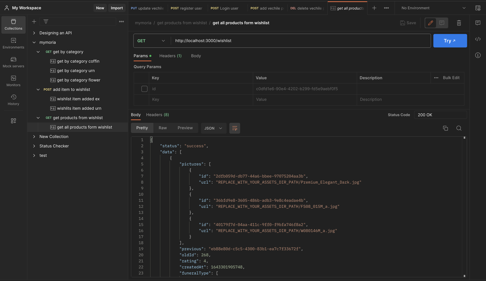
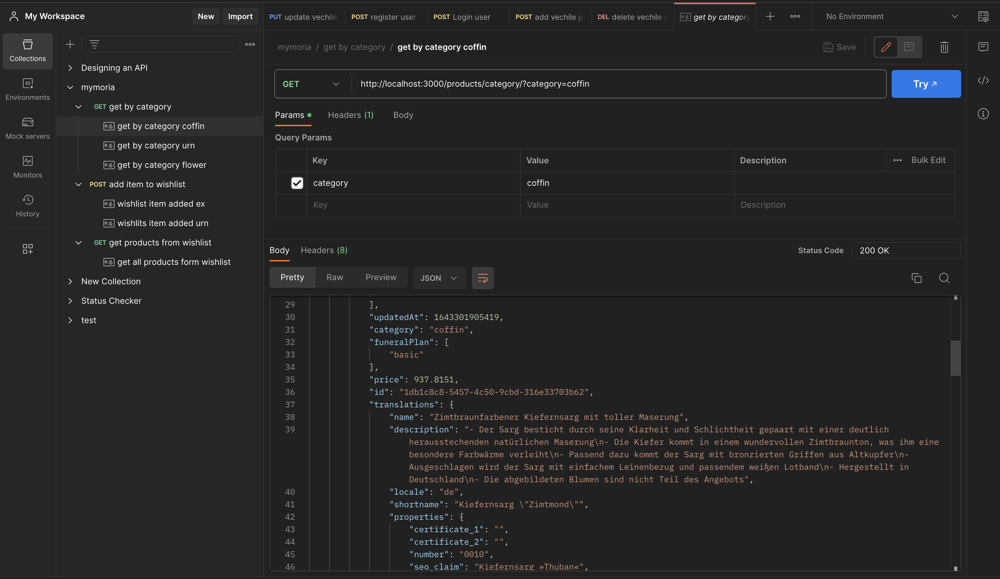

# Sample API to do CRUD operations based on categories 
## I used Node.js, TypeScript, Express, RoutingControllers, ClassValidators 

### Setup
* clone the repo
```sh
$ npm i
```
```sh
$ npm start
```
 npm start will start the server on port 3000 which is .env file. You can change portnumber according to your wish.


 ### Folder Structure

 ```ts
mymoria-api/
|-- build/
|-- src/
|   |-- data/ //data you provided for doing this task and also i am saving my wishlistids here by creating new (whishlistIds.json) file
|   |-- controllers/
|   |   |-- productController.ts // for reading products (endpoints)
|   |   |-- wishlistController.ts // for adding, reading products to wishlist (endpoints)
|   |-- dto/ //types
|   |   |-- productDTO.ts // type of user
|   |-- middelware/|   |   |-- validationErrors.ts //if we make error request then structured understandable error response is sent

|   |-- services/ //for accessing database (in our case the data you provided)
|   |   |-- productService.ts  // for CRUD on product database (users.json)
|   |   |-- wishlistService.ts  // for CRUD on wihslist database (users.json)

|   |-- index.ts/ // main file

|-- .env/ // basic project settings

|-- package.json
|-- README.md
|-- tsconfig.json
```

### Postman
* I used postman for making request so i saved all my request with examples and added here in this project as mymoria. It is post man collection json file.

### 3 Endpoints request screenshots
#### Get products by category
  

#### Post (ADD) id to wishlist
  

#### Get products from wishlist
  


